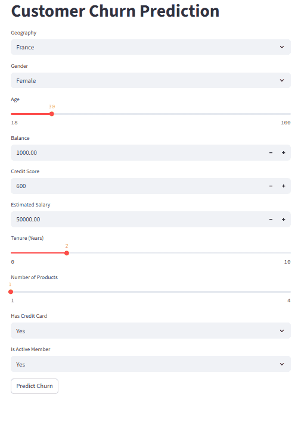

# 🧠 Customer Churn Prediction App

A web application built with **Streamlit** that predicts whether a customer is likely to churn, using an Artificial Neural Network (ANN) trained on structured customer data. The app takes user inputs like geography, age, credit score, and product usage to make real-time predictions and visualize churn risk.

🔍 Powered by:
- TensorFlow/Keras ANN model
- Scikit-learn for preprocessing
- Streamlit for the interactive frontend

## 🚀 Live App

Try the app here 👉 [Churn Prediction Web App](https://churn-ann-predict.streamlit.app/)

---

## 📸 Demo

